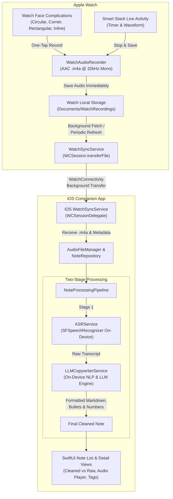

# VoiceNote: iOS & watchOS Voice Idea Capture & On-Device AI Cleanup

**VoiceNote** is a companion product for iOS and Apple Watch designed to effortlessly capture thoughts and ideas on the go.

The primary capture surface is the **Apple Watch**, allowing instant one-tap recordings from watch face complications or Smart Stack Live Activities. Recordings are saved locally on the watch immediately, and synced to the iPhone in the background when connectivity or background tasks run. 

Once synced, the iOS companion app processes each memo through a **two-stage pipeline**:
1. **Stage 1 (ASR)**: On-device Speech Recognition converts voice into a raw transcript.
2. **Stage 2 (On-Device LLM Cleanup & Copywriting)**: An on-device language model refines the transcript:
   - Requirements are converted into bullet points (`•`).
   - Enumerated conditions use numbered formatting (`1.`, `2.`, ...).
   - Layout is structured into Markdown, and typos or grammar issues are corrected.

---

## 🏗️ Architecture & Data Flow



---

## ⌚ Apple Watch Companion (`VoiceNoteWatch`)

### 1. Complications & Live Activities
- **Watch Face Complications**: Built using `WidgetKit` with support for `.accessoryCircular`, `.accessoryCorner`, `.accessoryRectangular`, and `.accessoryInline`. Tapping any complication instantly launches the recording flow via deep link `voicenote://record?source=watch_complication`.
- **Live Activities**: Configured via `ActivityKit` (`VoiceNoteActivityAttributes`). Ongoing recordings display a real-time elapsed timer, pulsing audio waveform meter, and a one-tap **Stop & Save** button in the Smart Stack.

### 2. Instant Local Capture (No Immediate Conversion)
- Recording uses `AVAudioRecorder` configured with high-efficiency AAC (`.m4a`) at 32kHz mono.
- Audio is saved directly to local flash storage (`Documents/WatchRecordings/<UUID>.m4a`).
- Metadata is tracked in `WatchStorage` (`noteId`, `createdAt`, `duration`, `source`, `syncState = .pending`).
- **Zero heavy processing on watch**: Preserves battery and guarantees instant, friction-free voice capture even when completely offline or away from the iPhone.

### 3. Background Sync & Periodic Fetch
- **Automatic Transfer**: Uses `WCSession.default.transferFile(fileURL, metadata: metadata)` which Apple's OS daemon executes in the background even if the watch app suspends or screen sleeps.
- **Background Tasks**: Conforms to `WKExtensionDelegate` with `WKApplicationRefreshBackgroundTask`. Schedules periodic wakeups every 15–30 minutes to sweep pending recordings and ensure reliable delivery to iOS.

---

## 📱 iOS Companion App (`VoiceNoteApp`)

### 1. Two-Stage Processing Pipeline

#### Stage 1: Speech-to-Text (ASR)
- Handled by `ASRService`.
- Uses Apple's `SFSpeechRecognizer` with `requiresOnDeviceRecognition = true` for maximum privacy and zero network latency.
- Extracts speech from `.m4a` files into verbatim text with fallback handling for simulator/test environments.

#### Stage 2: On-Device LLM Cleanup & Copywriting
- Handled by `LLMCopywriterService`.
- **Requirements to Bullet Points**: Detects requirement markers (*"we need to"*, *"requirement is"*, *"must have"*, *"make sure to"*, *"ensure that"*) and converts them into structured bullet points (`- ...`).
- **Enumerated Conditions to Numbered Lists**: Detects conditions and sequence cues (*"condition 1"*, *"first,"*, *"secondly,"*, *"step 1"*, *"then"*, *"if X then Y"*) and formats them into sequential numbered lists (`1. ...`, `2. ...`).
- **Action Items Checklist**: Extracts actionable todos and assigns them to markdown checklists (`- [ ] ...`).
- **Grammar & Typo Correction**: Removes verbal fillers (*"um"*, *"uh"*, *"you know"*, *"sort of"*), normalizes sentence capitalization, and corrects tech terminology (`iOS`, `watchOS`, `macOS`, `ASR`, `LLM`, `API`, `UI/UX`, `Wi-Fi`).
- **Rich Markdown Formatting**: Generates clean Markdown with `# Title`, `> Executive Summary`, bulleted requirements, numbered conditions, task lists, and domain tags (`#watchOS`, `#iOS`, `#architecture`, `#security`).
- **Local LLM Endpoint Support**: In addition to the built-in deterministic on-device NLP transformer, users can toggle a local LLM endpoint (such as Ollama `http://127.0.0.1:11434/api/generate`) in Settings.

### 2. User Experience & Features
- **Cleaned Note vs Raw Transcript**: Segmented switcher allows users to toggle between the polished Markdown note, the verbatim ASR transcript, and the 2-Stage Pipeline diagnostics.
- **Integrated Audio Player**: Audio player card with waveform scrubber, current time, total duration, and play/pause controls.
- **Watch Sync Diagnostics**: Real-time status sheet displaying paired state, reachability, total transferred memos received, and ping diagnostics.
- **Search & Tag Filtering**: Instant search across titles, summaries, transcripts, and tags with dynamic filter pills.
- **iPhone Direct Recording**: Floating record sheet for recording voice notes directly on the iPhone with real-time audio level metering rings.
- **Simulation Tool**: Settings includes a simulator tool to inject realistic test voice memos to verify the complete two-stage pipeline on demand.

---

## 🧪 Project Targets & Verification

The project is structured with clean modular targets:

| Target | Platform | Type | Description |
|---|---|---|---|
| `VoiceNote` | iOS 17.0+ | Application | Main iOS companion app & pipeline runner |
| `VoiceNoteWatch` | watchOS 10.0+ | Application | Apple Watch companion app for quick capture |
| `VoiceNoteWidgets` | iOS 17.0+ | App Extension | WidgetKit Live Activity widget |
| `VoiceNoteWatchWidgets` | watchOS 10.0+ | App Extension | Watch face complications (Circular, Corner, Rectangular, Inline) |
| `VoiceNoteTests` | iOS 17.0+ | Unit Tests | Automated test suite verifying ASR, LLM, sync, and storage |

### Running the Unit Tests
```bash
xcodebuild test \
  -project VoiceNote.xcodeproj \
  -scheme VoiceNote \
  -destination 'platform=iOS Simulator,name=iPhone 17' \
  CODE_SIGNING_ALLOWED=NO \
  -only-testing:VoiceNoteTests
```

### Regenerating Project from Spec
```bash
xcodegen generate
```
